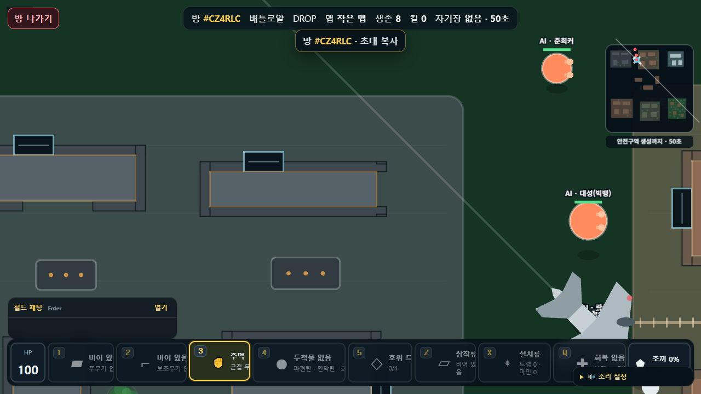
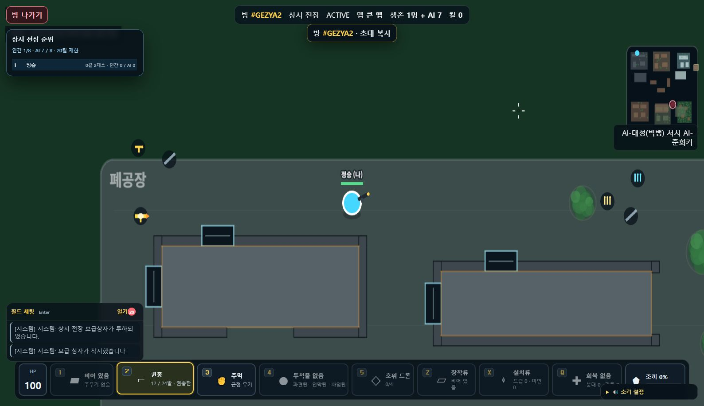
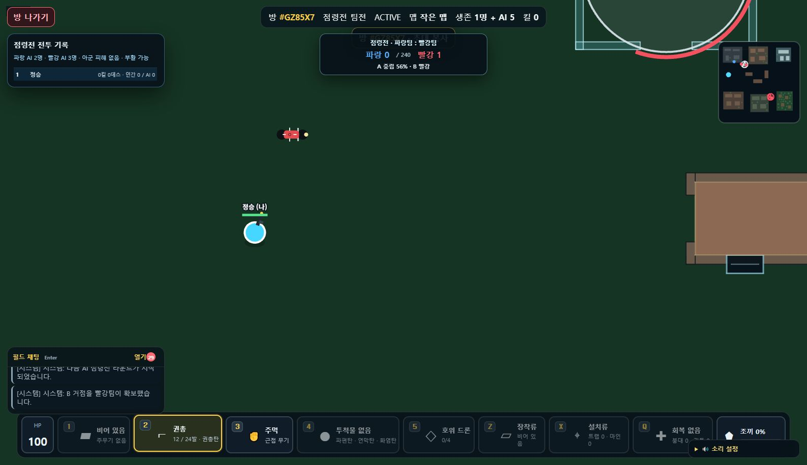
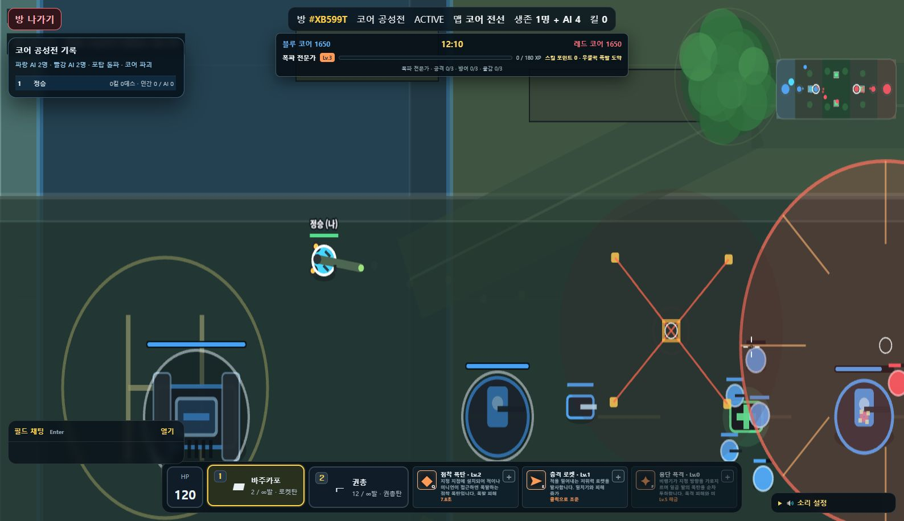

# DROP 8 — Core Siege Build

> 네 가지 전투 규칙을 하나의 실시간 탑다운 액션 게임으로 구현한 멀티플레이어 프로젝트입니다. 이 저장소는 코어 공성전까지 포함한 공개 빌드입니다.


## 1. 프로젝트 소개

`DROP 8`은 플레이어가 방을 만들고 AI 또는 다른 플레이어와 즉시 전장에 입장하는 실시간 탑다운 액션 게임입니다. 배틀로얄의 생존 압박, 상시전장의 빠른 리스폰, 점령전의 팀 목표, 코어 공성전의 영웅·타워·코어 공략을 하나의 게임 구조 안에 담았습니다.

## 2. 플레이 미리보기

| 배틀로얄 — 낙하·파밍·자기장 | 상시전장 — 리스폰·자유 전투·킬 경쟁 |
| --- | --- |
|  |  |
| 점령전 — A/B 거점 점령·팀 점수 | 코어 공성전 — 영웅 스킬·타워 돌파·코어 파괴 |
|  |  |

## 3. 구현한 핵심 기능

- 배틀로얄: 비행기 낙하, 루팅, 안전구역, 최후 생존 규칙
- 상시전장: 리스폰 기반의 자유 전투와 목표 킬 경쟁
- 점령전: A/B 거점 점령 상태와 파랑·빨강 팀 점수 경쟁
- 코어 공성전: 영웅 선택, Q/E/F 스킬, 미니언, 포탑과 코어 공략
- 공개방·초대 코드·대기실·AI 충원으로 이어지는 멀티플레이 매치 흐름
- 무기, 투척물, 회복, 장착류, 함정, 드론, 미니맵 HUD
- 클라이언트·서버가 공유하는 게임 규칙과 타입 정의

## 4. 만들며 배우고 싶었던 것 · 습득한 것

**목표**

단순히 캐릭터를 움직이는 게임을 넘어서, 실시간 동기화가 필요한 전투 규칙을 설계하고 모드마다 다른 재미를 만들고자 했습니다.

**습득**

- Colyseus 기반의 서버 권위 상태 동기화와 룸 생명주기 구성
- Phaser 렌더링과 HUD를 분리해 전투 정보를 읽기 쉽게 표현하는 방법
- TypeScript 공유 모듈로 클라이언트·서버 규칙 불일치를 줄이는 구조
- AI, 무기, 아이템, 점령, 공성처럼 서로 다른 시스템을 하나의 게임 루프에 통합하는 경험
- 각 모드의 승리 조건에 맞춰 UI와 피드백을 다르게 설계하는 경험

## 5. 기술 스택

| 영역 | 사용 기술 | 활용 |
| --- | --- | --- |
| Client | TypeScript, Phaser, Vite | 탑다운 전장 렌더링, 입력 처리, HUD |
| Server | Node.js, Express, Colyseus | 게임 룸, 서버 권위 판정, 실시간 동기화 |
| Shared | TypeScript workspace | 게임 규칙, 타입, 밸런스 데이터 공유 |
| Quality | ESLint, Vitest | 정적 검사와 규칙 테스트 |

## 6. 구조

```text
client/  ─ Phaser 기반 게임 화면과 UI
server/  ─ Colyseus 룸, 게임 상태·전투 판정
shared/  ─ 게임 모드, 맵, 아이템, 밸런스, 공용 타입
```

## 7. 로컬 실행

```bash
pnpm install
pnpm dev
```

브라우저에서 `http://localhost:2567`로 접속합니다. 같은 Wi-Fi에서 플레이하려면 `pnpm dev:lan`을 실행합니다.

## 8. 검증

```bash
pnpm check
```

타입 검사, 린트, 테스트, 빌드를 한 번에 실행합니다.

## 9. 다음 개선 방향

- 실제 사용자 플레이 데이터를 바탕으로 무기·영웅·AI 밸런스 조정
- 전투 하이라이트, 처치 기록, 튜토리얼을 보강해 첫 플레이 경험 개선
- 모드별 전장과 시각 효과를 확장해 플레이 개성을 더 선명하게 만들기

---

개발자: 정승 · 실시간 멀티플레이 게임 시스템과 게임 UX를 학습하기 위한 개인 프로젝트
